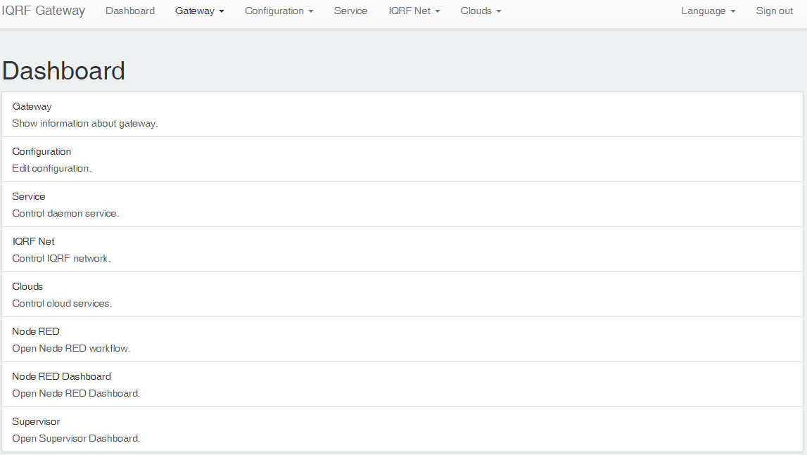

# IQRF Starter Gateway

Docker [image](https://hub.docker.com/r/iqrfsdk/iqrf-starter-gateway/) based on IQRF GW daemon solution. Usable with https://resin.io/.



- IQRF GW daemon
- IQRF GW webapp
- Nginx reverse proxy
- Mosquitto MQTT broker
- Node-RED logic and dashboard
- Supervisor

## UP board

### User build

```Bash
docker build -f amd64-stable.Dockerfile -t iqrfsdk/iqrf-starter-gateway-debian .
```

### Run

```Bash
docker container run -d -p 80:80 -p 1880:1880 -p 1883:1883 -p 9001:9001 --device /dev/spidev2.0:/dev/spidev2.0 \ 
--privileged --name iqrf-starter-gateway --restart=always iqrfsdk/iqrf-starter-gateway-debian
```

### Login

```Bash
http://YOUR-IP/
user: admin
pass: iqrf
```

## RPI board

### User build

```Bash
docker build -f rpi-stable.Dockerfile -t iqrfsdk/iqrf-starter-gateway-raspbian .
```

### Run

```Bash
docker container run -d -p 80:80 -p 1880:1880 -p 1883:1883 -p 9001:9001 --device /dev/spidev0.0:/dev/spidev0.0 \
--privileged --name iqrf-starter-gateway --restart=always iqrfsdk/iqrf-starter-gateway-raspbian
```

### Login

```Bash
http://YOUR-IP/
user: admin
pass: iqrf
```
